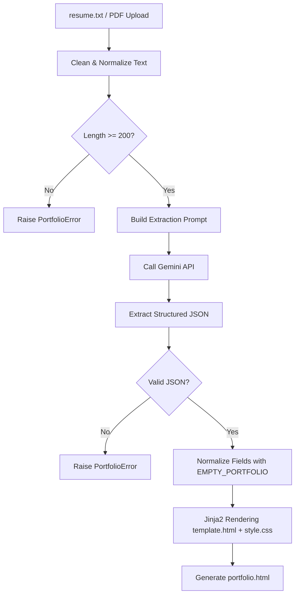

# 🎓 AI-Assisted Resume Portfolio Generator
> **AIML GLA Bootcamp '26 — Group Project**  
> An automated, high-fidelity pipeline that transforms raw resume text or PDF documents into a premium, interactive glassmorphic web portfolio.

---

## 🚀 Key Features

*   **Dual Entry Points**: Clean CLI program (`main.py`) for automated local builds and a sleek Flask Web GUI (`app.py`) for drag-and-drop PDF parsing.
*   **Structured AI Extraction**: Utilizes Google Gemini (`gemini-2.5-flash`) via the official `google-genai` client for ultra-reliable, zero-hallucination structured data extraction.
*   **Aesthetic & Modern Theme**: Generates a responsive, two-column glassmorphic portfolio featuring custom Google Fonts (*Plus Jakarta Sans* & *JetBrains Mono*), smooth CSS transitions, and a persistent dark/light mode toggle.
*   **Robust Fallbacks**: Complete structural normalization—no crashes if fields are missing or malformed in the API response.

---

## 🗺️ Project Architecture & Workflow

Below is the step-by-step pipeline illustrating how resume text is processed, validated, structured, and rendered.



---

## 🛠️ Installation & Setup

Follow these instructions to set up and run the generator locally.

### 1. Prerequisites
Ensure you have **Python 3.10 or higher** installed.

### 2. Clone and Setup Environment
Clone this repository to your local machine, open your terminal (PowerShell for Windows, or Bash), and navigate to the project directory:

```powershell
# Create a virtual environment
python -m venv venv

# Activate the virtual environment
# On Windows (PowerShell):
.\venv\Scripts\activate
# On Linux/macOS:
source venv/bin/activate

# Install required dependencies
pip install -r requirements.txt
```

### 3. API Key Configuration
This project keeps the API credentials secure by using environment variables. 

1. Copy the `.env.example` template:
   ```powershell
   copy .env.example .env
   ```
2. Open the new `.env` file and insert your API key from [Google AI Studio](https://aistudio.google.com/):
   ```env
   GEMINI_API_KEY="AIzaSyYourActualKeyHere..."
   GEMINI_MODEL="gemini-2.5-flash"
   ```

> [!WARNING]
> Never commit your `.env` file to GitHub or expose your API keys publicly. The `.gitignore` file is configured to block `.env` automatically.

---

## 💻 Running the Generator

### Option A: Command Line (CLI) Workflow
1. Open the file `resume.txt` in the root folder and paste your resume text.
2. Run the script:
   ```powershell
   python main.py
   ```
3. The program will validate the input, request the structured JSON from Gemini, render `portfolio.html`, and automatically open it in your default web browser.

### Option B: Local Web GUI (PDF Upload)
1. Run the Flask application:
   ```powershell
   python app.py
   ```
2. Open your browser and go to `http://127.0.0.1:5000`.
3. Upload any standard text-based `.pdf` resume. The web app converts it to text, writes it to `resume.txt`, runs the generation pipeline, and displays your generated portfolio instantly.

> [!IMPORTANT]
> The Flask web server runs on local loopback (`127.0.0.1`) only. It does **not** provide multi-user session isolation and must not be exposed to the public internet.

### Option C: Pure Client-Side Generator (Browser Only)
1. Double-click or open [`generator.html`](file:///d:/resume-portfolio-generator/generator.html) in any web browser.
2. Enter your Gemini API key from [Google AI Studio](https://aistudio.google.com/apikey). (It is securely processed in the client browser only and optionally saved locally).
3. Drag and drop your `.pdf` or `.txt` resume file, or paste its text.
4. Click **Generate Portfolio** to preview the rendered layout instantly inside the interactive preview pane.
5. Click **Download Portfolio** to save your custom `portfolio.html` file.

---

## 📝 Prompt Design & AI Control

To guarantee that the LLM functions as a strict information extractor rather than a creative writer, `pipeline.py` builds a highly controlled prompt.

### Prompt Construction Principles:
*   **Strict Context Restriction**: Instructs Gemini to use *only* information explicitly present in the text and prohibits inventing skills, companies, dates, or contact info.
*   **Empty Value Rule**: Directs the LLM to output empty strings (`""`) or empty lists (`[]`) instead of placeholders like `"N/A"` or `"Unknown"` for missing sections. This enables clean conditional rendering in Jinja.
*   **Concise Summaries**: Constraints the summary to 2-3 strictly factual sentences to avoid generic marketing fluff.
*   **MIME Enforced Output**: Instructs the model to output *only* raw JSON conforming to a specified TypeScript-like interface.

---

## 🧪 Mandatory Test Cases Log

The application has been verified against the 7 mandatory test cases outlined in the project brief:

| Test Case | Inputs / Conditions | System Behavior | Output / Result |
| :--- | :--- | :--- | :--- |
| **1. Missing `resume.txt`** | Rename or delete `resume.txt` and run CLI. | `load_resume_text()` detects file absence. | Safely stops with: `[ERROR] 'resume.txt' was not found...` |
| **2. Empty or Short Resume**| File has `< 200` characters after space cleaning. | `validate_resume_text()` checks string length. | Safely stops with: `[ERROR] The resume text only has X characters...` |
| **3. Valid Resume** | Normal structured resume in `resume.txt`. | Full pipeline runs: Clean -> API -> Parse -> Render. | Saves and opens `portfolio.html` successfully. |
| **4. Missing Sections** | Resume with no projects or achievements listed. | App uses `EMPTY_PORTFOLIO` defaults; Jinja hides sections. | Portfolio renders without blank headers or placeholders. |
| **5. Missing API Key** | Empty or missing `GEMINI_API_KEY` in `.env`. | `call_gemini()` checks env variable. | Safely stops with configuration instructions. |
| **6. API Failure** | Disconnect internet / block API endpoint. | Catches network exceptions. | Safely outputs friendly error to user instead of raw stacktrace. |
| **7. Invalid JSON Response**| Spoofed output that is not parsable JSON. | `parse_portfolio_json()` catches `JSONDecodeError`. | Stops safely with: `Gemini did not return valid JSON.` |

---

## 🛡️ Responsible AI & Privacy

*   **PII Notice**: During testing, do not include highly sensitive personal information (such as SSNs, passport numbers, home addresses, or financial information) in `resume.txt`.
*   **Hallucination Risks**: Although the prompt is heavily constrained, LLMs can occasionally experience hallucinations. **Always verify the generated portfolio against your original resume** before using it professionally.
*   **Secure Implementation**: The Gemini API is called exclusively from the secure, server-side Python environment (`pipeline.py`). No API keys are ever exposed in client-side HTML or Javascript.

---

## 🤖 AI Usage Log

Consistent with GLA Bootcamp rules, AI assistants were utilized for development acceleration. Here is our usage log:

| Tool | Prompt / Request | What the Tool Generated | Modifications / Review Done |
| :--- | :--- | :--- | :--- |
| **Gemini 2.5 Flash** | "Provide a schema-validation and default-filling algorithm for Python dictionaries to match missing JSON keys." | Draft code for `normalize_portfolio` utilizing a dictionary-merging template. | Adapted values to match `EMPTY_PORTFOLIO` schema and added explicit lists sanitization (filtering out non-string elements). |
| **Antigravity** | "Design a responsive glassmorphic layout with a dark/light mode toggle that prevents the flash of incorrect theme on load." | CSS variables layout along with head-blocking inline JS checking `localStorage`. | Verified compatibility, customized colors to premium teal accent shades, and added print media CSS overrides. |

---

## 📁 Repository Structure

```text
resume-portfolio-generator/
│
├── templates/
│   └── upload.html          # HTML Template for local Flask GUI
│
├── .env.example             # Configuration template for local API keys
├── .gitignore               # Excludes secrets (.env) and Python artifacts (venv)
├── app.py                   # Local Flask GUI entry point (supports PDF upload)
├── generator.html           # Client-side generator app (PDF parse + Gemini call in browser)
├── main.py                  # CLI entry point (converts resume.txt -> portfolio.html)
├── pipeline.py              # Shared orchestration, validation, API logic, and rendering
├── portfolio.html           # The generated web portfolio output file
├── requirements.txt         # List of dependency packages
├── resume.txt               # Input source text resume
├── style.css                # Base stylesheet loaded dynamically during HTML gen
├── template.html            # Main template used by Jinja2 to structure the portfolio
└── venv/                    # Local Python virtual environment (ignored by Git)
```

---

## 👥 Group Contribution details
*   **Student 1**: Core pipeline design & Gemini API integration (`pipeline.py`).
*   **Student 2**: Web interface setup & PDF parser integration (`app.py`, `upload.html`).
*   **Student 3**: Prompt engineering & strict validation schema.
*   **Student 4**: CSS Stylesheet styling, glassmorphism, responsive sidebar design.
*   **Student 5**: Testing, documentation compiling (`README.md`), and validation logs.

---
*Developed for **AIML GLA Bootcamp '26** Group Project.*
